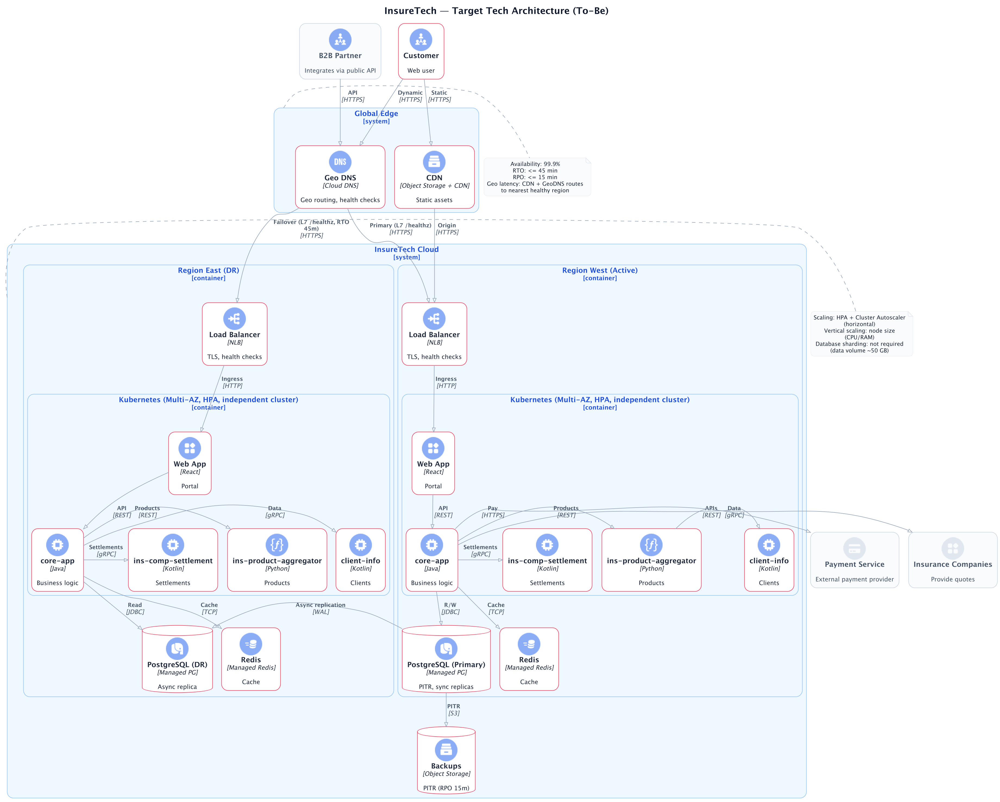
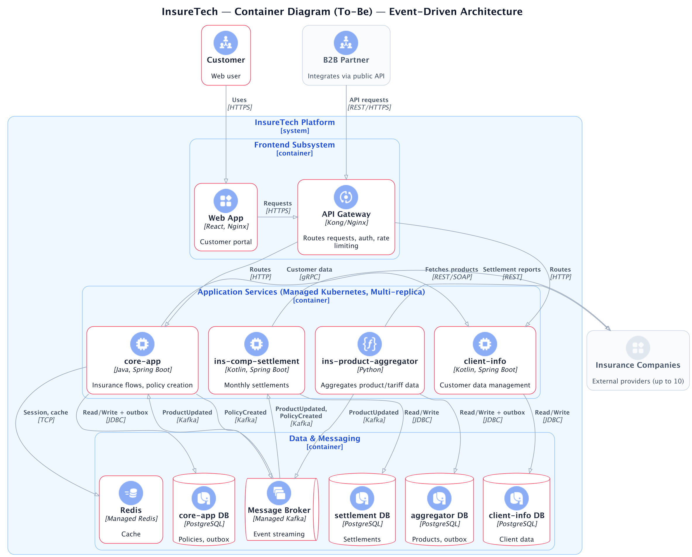
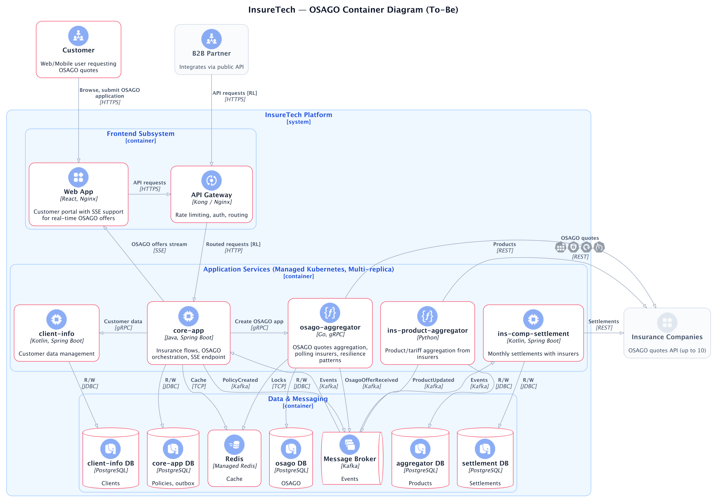

# InsureTech Architecture Project

## Technology Stack

  
  
  
  
  
  
  
  
  

Insurance platform architecture with multi-region resilience, event-driven communication, and auto-scaling capabilities.

## Architecture Overview

## Project Artifacts

| Focus | Key Artifacts |
|-------|---------------|
| Multi-region architecture | [ADR-0001](Task1/ADR-0001-architecture-decisions.md), [C4 diagrams](Task1/inuretech-tech-arch-to-be.puml) |
| Dynamic auto-scaling | [HPA configs](Task2/manifests/), [metrics report](Task2/reports/metrics-report.md) |
| Event-driven migration | [Transactional outbox](Task3/risks.md), [container diagram](Task3/insuretech-container-to-be.puml) |
| OSAGO service design | [gRPC+Kafka pattern](Task4/ADR-0002-osago-architecture-decisions.md) |
| GraphQL API | [Schema design](Task5/client-info.schema.graphql) |
| Rate limiting | [Nginx config](Task6/nginx.conf), [trace matrix](Task6/trace-matrix.md) |

## Key Decisions

- **Multi-region active-active** with GeoDNS and automated failover
- **Event-driven communication** using Kafka with transactional outbox pattern
- **Auto-scaling** based on memory (80%) and RPS metrics via Prometheus
- **OSAGO aggregator** implementing gRPC services with Circuit Breaker pattern

## Navigation

📋 **For detailed review**: See [project-template.md](project-template.md) for complete artifact matrix and evidence.
